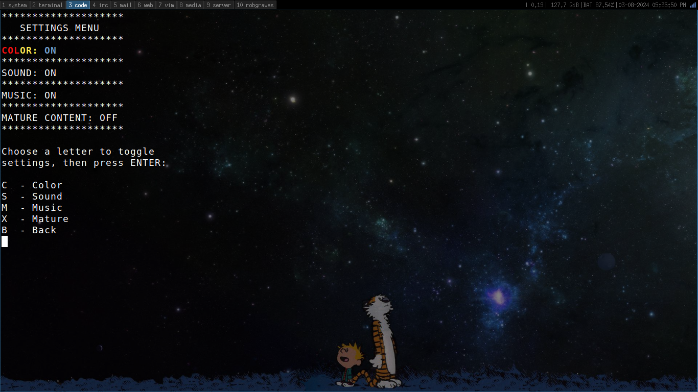

# crapsgame

Matthew Page

me@matthewjpage.com

INSTRUCTIONS:

-To play, using python 3, run from command line:

`python3 main.py`

FILES:

main.py 	-  main game file

README.md   -  this file

data/save/userdata.p  -  user data is stored here

data/save/config.p - config settings for game

data/save/default_config.p - default settings for recovery

data/graphics/graphics.py - ASCII art for game

data/sounds/tonight.wav - intro sound when game starts
	NOTE: This file is probably copyrighted and is merely a
placeholder until I can find a substitute,

data/sounds/proleter-throwitback.wav - song in credits,
ProleteR - Throw It Back (feat. Task Rok)
	NOTE: This file is probably copyrighted and is merely a
placeholder until I can find a substitute,

data/sounds/diceroll.wav - sound effect for dice rolls

data/sounds/aww.wav - sound effect for shooter losing

data/sounds/applause.wav - sound effect for shooter winning

data/sounds/claps.wav - sound effect for shooter winning

data/sounds/winsound.wav - sound effect for any other bet winning

data/sounds/chips.wav - sound effect for any other bet winning

data/images - screenshots for README

03/27/2024

More modification of credits and adding a song to the credits reel.

03/26/2024

Added credits option to mostly credit myself for fun, but throw in a couple of my
friends and family for helping with this uncompleted project for testing
and whatnot. 

03/25/2024

Been working on trying to fix music bug in Windows to no avail.  Been trying 
multiple powershell commands Start-Job, Start-Process, etc to try to run the 
menu music in the background.  As it stand this works in Linux without a hitch
but in Windows it will play the music in its entirety before executing the
rest of the code which actually loads the menu.
Also added a default config file for which to use to recover config settings
if the system being played on does not happen to have sound or color capability
without editing the code, just need to copy data/save/default.config.p to
data/save/config.p this also will resolve any issues with people who may have
an earlier version of my settings menu and get errors when starting after 
pulling to current. (As if anyone other than my immediate family and friends
are even playing this game, LOL :D )

03/15/2024

Been experimenting with making my randomness for my dice rolls even more 
random.  This has concluded now with using instead of random.SystemRandom()
exclusively as I was before, I am now creating a composite of an integer 
generated by that method alongside the username of the player where each
character is converted to its ASCII code and added together, along with
the players current bankroll, a timestamp, and the previous dice result, 
all of these added together on each dice roll to be the seed number for
random.seed() function.  Haven't tested this extensively yet, but I wanted
to see how much randomness I could get into my dice rolls.  From a coding
perspective it works 100% now, just need to test the way it playes further.

03/08/2024

Added seperate variable to control music, fixed bug with bankroll not
colorized after returning from mature content.
NOTE: Updated changes to settings require deleting old settings file at:
 data/save/config.p  OR data\save\config.p

03/02/2024

Added an intro sound when game starts.

03/01/2024

Added showing username at the top of the screen.
Fixed bug where player chooses returning player but enters invalid
player causes game to crash.  Also changed all instances of Quit key
to Q or q as the inconsistency was driving me mad.  Looks more uniform
now.

02/29/2024

Finished settings menu, with options for color, sound, and mature content.
All seems to work and save settings in data/save/config.p and reload on
game start.  Creates the file if it doesn't exist.
nullist did some refactoring to the graphics.py file to make it easier to
change colors.

02/28/2024

Implemented color to the game, now switchable with the colorized variable.
Plans to implement sound on or off with the soundfx variable,
these two combined with the mature variable will be combined into a settings
file loaded on startup and saved back to on quitting like the user data does now.

02/24/2024

My coding partner from college, nullist (Tyler Mosgrove), contributed color to the bankroll,
green for anything positive and red for bankrupt.  This inspired me to colorize the whole
game and make it optional.  Which makes me want to put in a Settings menu to 1) turn on
or off color, 2) turn on or off sounds, and 3) switch between general gameplay and the
mature gameplay.

12/24/2023 

Resuming Testing of Craps Game, definitely need deeper Wrong Bettor
testing as I usually play Right side and have thus favored testing 
those bets.

07/20/2023

It appears as if Odds on Come and Don't Come bets are working.
Needs some thorough testing.  But this would mean officially I
have a full functioning craps game, maybe still some bugs here
and there, but the game works and has all of the bets functioning.

07/13/2023

Simple modification, changed ASCII graphics to stagger
the two dice to make it more aesthetically pleasing.
Wrote betting for Odds on Come and Don't Come but haven't 
implemented payouts or losses yet.  
Also noting I want to implement at bare minimum a 5x odds limit on
a come odds bet.  But ideally a 5x-4x-3x for 6/8,5/9,4/10 respectively
and then change my current universal 5x limit on odds for pass and 
don't pass to 5x-4x-3x as well for same point numbers.
Currently the whole function is a Work In Progress.

07/12/2023

Removed Linux dependence on mplayer for sound, switching to aplay
from ALSA package which is probably on most Linux desktops.
Also added potentially MacOS support in addition to the recent adding
of Windows support.  Have tested and played both the Windows and Linux
versions, but am not sure how well or if it works properly in MacOS as
I don't own any Mac systems.

07/11/2023

Adapted the craps game to work in Windows.  To do this 
effectively, I had to convert all sound files into WAV 
files, no big deal.

01/20/2023

I may have found the hanging bug I had from the previous couple of 

commits.  My initial thought was that it had something to do with

my save function, which calls pickle as I had/have it saving multiple

times in a round of gameplay.  I also had read online that pickle was

slow and people were suggesting JSON, which I may still switch over to.

But it is currently my thought that it was my sound files that were

causing the bottleneck as I call a certain soundfile to be played anytime

a bet wins, but that could be multiple bets winning simultaneously which means

I could have a ton of system calls to play the same exact winning sound every

time, so I switched all those sound calls to just switching a variable from a 

0 to a 1, and then at the end of each stage checking that variable if it's 1 to

play the win sound.  Only further extensive testing will tell if I'm right, but

it appears to be fixed.

01/18/2023

Finished function for Come and Don't Come bets that mostly work

but there do seem to be some erroneous payouts, or rather not

paying out when it should and/or not taking the bet when it should.

Additionally I have a nasty bug that happens occasionally within the 

Come/Don't Come function that causes the game to hang for 10 to 20 

seconds.  

I think the solutions to both of these problems is some further 

reorganization and restructuring of the code as I have payouts

and bet losses all handled outside of a function that has repeated

sections of code, so I plan to move all the payouts/losses into 

function(s).  The other plan is to make all the functions take

and return multiple variables, which I didn't realize you could do

in Python, so I can eliminate all of my global variables, and then chop

up all my functions into seperate files, so that the main function ends up

being mostly just a series of function calls so I can scan through it

quicker to find bugs in the game flow.

That's the plan anyway.  Unsure the timespan to accomplish the above,

but starting that soon.

01/16/2023

Added the ability to NOT bet on Pass or Don't Pass on come out

roll.  Also limited Free Odds bets to 5x the pass/dp bet.

Also changed Field Bet payout for 12 from 3x to 2x to match the 2.

01/13/2023

Propositions bets appear to be working, this includes 2,3,11,12, 

also the hardways for 4,6,8,10, as well as any seven, and any craps

Added Big 6, Big 8, C&E, and World bets under Miscellaneous bets

Works but needs more rigorous testing to ensure accuracy.

01/09/2023

Place, Buy, and Lay bets completed and appears to be working.

Needs some thorough testing to make sure there are no hiccups

anywhere.

01/07/2023

Place bets with option to take down bets appears to be

fully functional.  Next on to Buy bets and Lay bets.

Also added more sounds.

01/03/2023

Free odds bets for Pass/Don't Pass are fully functional 

and reorganized code into a folder and a couple files

renamed craps.py to main.py

NOTE:	If you have an earlier pull of this like I do and want to keep your bankroll

then you will need to move your userdata.p into the new data folder

	
12/28/2022

Fully functional game with only the Pass/Don't Pass betting options, saving and loading works.

TO DO:

All other betting options:

DONE! 12/30/2022 - Free odds bets on Pass/DP

DONE! 01/21/2023 - Come bet/Don't Come Bets

DONE! 07/20/2023 - Free odds bets on Come/Don't Come

DONE! 01/03/2023 - Field Bets

DONE! 01/07/2023 - Place Bets/Buy Bets/Lay Bets

DONE! 01/13/2023 - Propostions bets,Hardway Bets/Any Craps/Any Seven

- Any other bets or features I might want to add:

DONE! 01/13/2023 - Big 6 and Big 8

DONE! 01/13/2023 - C&E Bet (Craps and Eleven)

DONE! 01/13/2023 - World Bet (C&E plus any seven)

12/26/2022

Toying with this command line craps game again hoping to make it functional.

11/15/2019 

After a hiatus from working on this I am trying to structure this is some way that I don't end up with a mess of spaghetti code.  Need to plan out all the functions and program control flow that I'm going to need for this game to 
function properly.

07/15/2019

This is just an experiment with me learning python again and trying to get back into coding after a hiatus.
So I'm just learning python while trying to write a command line Craps game because I love playing craps at the casinos.

I started working on this a few weeks ago but decided to make a repo for it so I don't lose my progress and feel more secure about making major changes.
